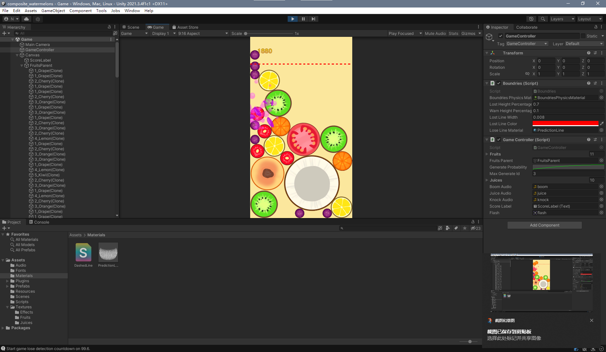

# composite_watermelons
A Unity 2021.3.4f powered reproduction game of the "Composite Big Watermelons".

[[WebGL Demo]](https://net2cn.github.io/composite_watermelons/) (On mobile platforms, sound effects may not be played properly.)

## Usage
C'mon, it's Unity project. Just learn the basics and you'll know how to build the project.

## Build Prerequisites
- Unity 2021.3.4f1c1 (this is the exact version of the Unity that this game is produced with.)
- Visual Studio 2022 (2019 works too.)

## Acknowledgements
This repository contains original game assets (images, sound effects) from the original game. This repository has no intention of being profitable, nor damage the legal rights of the original game author(s), but only for educational, self-training and entertainment purpose only.

The visual and audio assets provided by net2cn ("I," "me," or "my") on https://github.com/net2cn/composite_watermelons (the "Repository") and my application is for general informational purposes only. All visual and audio assets on the Repository and my application is provided in good faith, however I make no representation or warranty of any kind, express or implied, regarding the accuracy, adequacy, validity, reliability, availability, or completeness of any visual and audio assets on the Repository or my application. UNDER NO CIRCUMSTANCE SHALL I HAVE ANY LIABILITY TO YOU FOR ANY LOSS OR DAMAGE OF ANY KIND INCURRED AS A RESULT OF THE USE OF THE REPOSITORY OR MY APPLICATION OR RELIANCE ON ANY VISUAL AND AUDIO ASSETS PROVIDED ON THE REPOSITORY AND MY APPLICATION. YOUR USE OF THE REPOSITORY AND MY APPLICATION AND YOUR RELIANCE ON ANY VISUAL AND AUDIO ASSETS ON THE REPOSITORY AND MY APPLICATION IS SOLELY AT YOUR OWN RISK.

Apart from the disclaimer above, the source code under the directory of the path "Assets/Scripts" is license under the MIT License.

2022, net2cn.